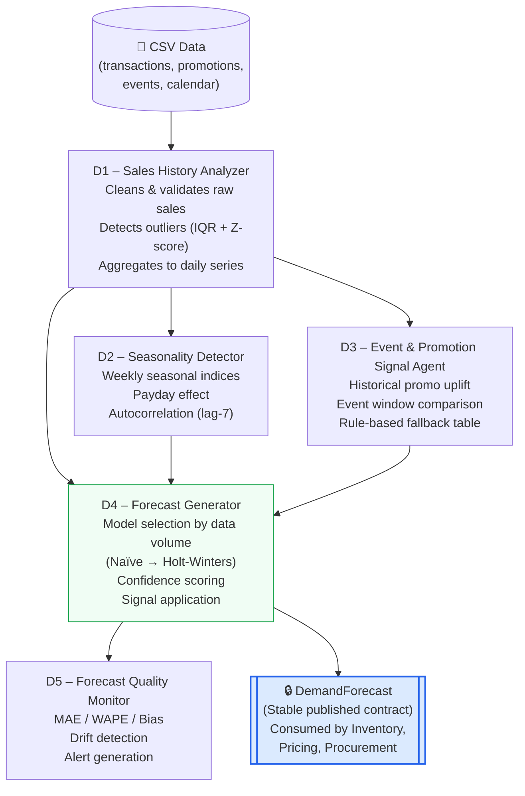
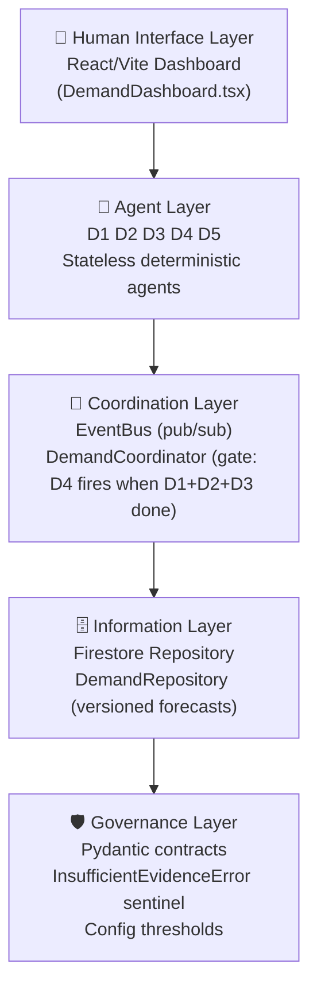
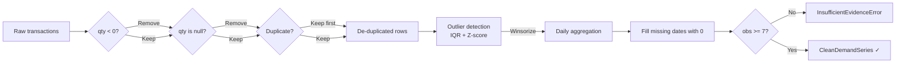

# Demand Sensing Domain — Architecture

Member 1 · SMME Retail Agentic AI System

---

## Agent pipeline

---

## Five-Layer Reference Architecture

---

## Data quality pipeline (D1)

---

## Model selection (D4)

| Observations | Model candidates |
|---|---|
| ≥ 7 | Naïve, Rolling Mean |
| ≥ 14 | + Seasonal Naïve |
| ≥ 28 | + Exponential Smoothing |
| ≥ 60 | + Holt-Winters |

Selection criterion: lowest WAPE on 7-day backtest window.

---

## API endpoints summary

| Method | Path | Description |
|---|---|---|
| `POST` | `/demand/pipeline/run` | Run full D1→D5 for all products |
| `GET` | `/demand/forecast/{product_id}` | Latest forecast |
| `GET` | `/demand/series/{product_id}` | Clean demand series |
| `GET` | `/demand/seasonality/{product_id}` | Seasonality profile |
| `GET` | `/demand/signals/{product_id}` | Active signals |
| `GET` | `/demand/quality/{product_id}` | Quality report |
| `GET` | `/metrics/evaluation` | Cross-product WAPE/MAE table |
| `POST` | `/agents/D1/run` | Run D1 only |
| `POST` | `/agents/D2/run` | Run D2 only |
| `POST` | `/agents/D3/run` | Run D3 only |
| `POST` | `/agents/D4/run` | Run D4 only |
| `POST` | `/agents/D5/run` | Run D5 only |
